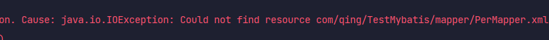
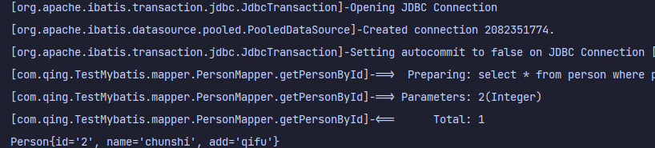
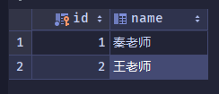
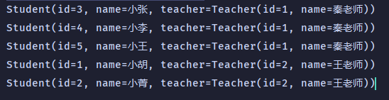
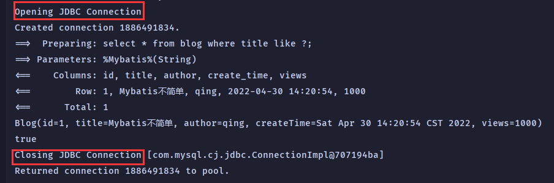

# Mybatis

## 基本概念

Mybatis，原名iBatis，原来是apache的一个开源项目，2010年迁移到Google code，改名Mybatis。2013年迁移到Github。

**官方文档**：[mybatis – MyBatis 3 | Introduction](https://mybatis.org/mybatis-3/zh)

**依赖**

```xml
<!-- https://mvnrepository.com/artifact/org.mybatis/mybatis -->
<dependency>
    <groupId>org.mybatis</groupId>
    <artifactId>mybatis</artifactId>
    <version>3.5.2</version>
</dependency>
```

**持久化**

持久化是将程序数据在持久状态和瞬时状态间转换的机制。

瞬时数据：比如内存(断电即失)中的数据，是不能永久保存的

所以，持久化通俗的讲，就是瞬时数据持久化为持久数据。

如将内存中的数据储存到数据库，磁盘文件，xml文件中。

JDBC就是一种持久化机制，文件IO也是一种持久化机制。

**持久层**

完成持久化工作的代码块

## MyBatis程序

导入依赖：

```xml
<dependency>
    <groupId>mysql</groupId>
    <artifactId>mysql-connector-java</artifactId>
    <version>8.0.26</version>
    <scope>runtime</scope>
</dependency>
<!-- https://mvnrepository.com/artifact/org.mybatis/mybatis -->
<dependency>
    <groupId>org.mybatis</groupId>
    <artifactId>mybatis</artifactId>
    <version>3.5.2</version>
</dependency>
<dependency>
    <groupId>junit</groupId>
    <artifactId>junit</artifactId>
    <version>4.12</version>
    <scope>test</scope>
</dependency>
```

注意：`junit`的作用范围是`test`，想在别处使用要修改作用范围

工具类：用于获取SqlSession

```java
// Mybatis工具类：用于获取sqlSessionFactory -> sqlSession
public class MybatisUtil {
    private static SqlSessionFactory sqlSessionFactory;

    static {
        try {
            // 1.获取sqlSessionFactory对象
            String resource = "mybatis-config.xml";
            InputStream inputStream = Resources.getResourceAsStream(resource);
            sqlSessionFactory = new SqlSessionFactoryBuilder().build(inputStream);
        } catch (IOException e) {
            e.printStackTrace();
        }
    }

    // 获取sqlSession对象
    // sqlSession中完全包含了面向数据库执行sql命令所需的所有方法
    public static SqlSession getSqlSession() {
        return sqlSessionFactory.openSession();
    }
}
```

`mybatis-config.xml`配置文件

```xml
<?xml version="1.0" encoding="UTF-8" ?>
<!DOCTYPE configuration
  PUBLIC "-//mybatis.org//DTD Config 3.0//EN"
  "http://mybatis.org/dtd/mybatis-3-config.dtd">
<configuration>
  <environments default="development">
    <environment id="development">
      <transactionManager type="JDBC"/>
      <dataSource type="POOLED">
        <property name="driver" value="${driver}"/>
        <property name="url" value="${url}"/>
        <property name="username" value="${username}"/>
        <property name="password" value="${password}"/>
      </dataSource>
    </environment>
  </environments>
  <mappers>
    <mapper resource="org/mybatis/example/BlogMapper.xml"/>
  </mappers>
</configuration>
```

## 使用XML配置

```java
public interface PersonMapper {
    public Person getPersonById(Integer personId);
}
```

定义一个Mapper接口，执行数据库的查询操作

`PerMapper.xml`

```xml
<?xml version="1.0" encoding="UTF-8" ?>
<!DOCTYPE mapper
        PUBLIC "-//mybatis.org//DTD Mapper 3.0//EN"
        "http://mybatis.org/dtd/mybatis-3-mapper.dtd">
<mapper namespace="com.qing.TestMybatis.mapper.PersonMapper">
    <select id="getPersonById" resultType="com.qing.TestMybatis.entity.Person" parameterType="Integer">
        select * from person where personId = #{personId}
    </select>
</mapper>
```

(相当于原来的Imp)

`namespace` 用于绑定一个Mapper接口

`id` 对应原来方法的名字

`resultMap,resultType`返回的结果集，前者返回多个，后者返回单个，值为实体类(集合也是)，注意路径

`parameterType`输入的参数类型

`#{personId}`输入的参数

原来需要实现Mapper接口，现在只需要在xml文件中配置即可

优点：

- 省去了原来的jdbc连接代码，返回结果集的代码；

- 修改方便，只需要修改接口和xml文件即可

## 常见Bug


遇到的报错：

1. 

原因：未注册mapper，每一个mapper都需要在`mybatis-config.xml`中注册

```xml
<mappers>
    <mapper resource="com/qing/TestMybatis/mapper/PerMapper.xml"/>
</mappers>
```

注意：

- `resource`中间必须是`/`
- mapper必须是==xml==文件

2. 

或`java.lang.ExceptionInInitializerError`初始化错误==【最常见】==

原因：**由于Maven的约定大于配置，xml文件被过滤**

解决：

```xml
<build>
    <resources>
        <resource>
            <directory>src/main/java</directory>
            <includes>
                <include>**/*.properties</include>
                <include>**/*.xml</include>
            </includes>
            <filtering>true</filtering>
        </resource>
    </resources>
</build>
```

Tips：实体类中的属性可以直接取

```xml
<insert id="save" parameterType="com.qing.TestMybatis.entity.Person" >
    insert bank.person(personId,name, address) VALUE (#{personId},#{name},#{address})
</insert>
```

正因如此，实体类必须跟数据库中的数据一一对应。

**增删改必须提交事务**

```java
sqlSessionFactory.openSession(true);
```

自动提交事务

## 万能Map

给Dao传参的时候，如果`parameterType`是一个实体类，就必须要构造完整的对象作为参数，或者写不同的构造方法，map很贴心的解决了这一难题。

简单应用

```java
@Test
public void addPerson(){
    SqlSession sqlSession = MybatisUtil.getSqlSession();
    PersonMapper mapper = sqlSession.getMapper(PersonMapper.class);
    Map<String, Object> map = new HashMap<>();
    map.put("id", 6);    // map中的键可以随意设置名字，可以不需要一一对应
    map.put("hometown", "shandong");
    Integer n = mapper.save(map);
    sqlSession.commit();
    sqlSession.close();
}
```

```xml
<insert id="save" parameterType="map">
    insert bank.person(personId, address) VALUE (#{id},#{hometown})
</insert>
```

运行结果：


当实体类的属性过多，应当考虑使用map

## 模糊查询

方式一：

```java
<select id="getPersonLike" resultType="com.qing.TestMybatis.entity.Person">
    select * from person where name like concat('%',#{name},'%')
</select>
```

方式二：

```java
List<Person> list = mapper.getPersonLike("%q%");
```

## 配置解析

```xml
<?xml version="1.0" encoding="UTF-8" ?>
<!DOCTYPE configuration
  PUBLIC "-//mybatis.org//DTD Config 3.0//EN"
  "http://mybatis.org/dtd/mybatis-3-config.dtd">
<configuration>
  <environments default="development">
    <environment id="development">
      <transactionManager type="JDBC"/>
      <dataSource type="POOLED">
        <property name="driver" value="${driver}"/>
        <property name="url" value="${url}"/>
        <property name="username" value="${username}"/>
        <property name="password" value="${password}"/>
      </dataSource>
    </environment>
  </environments>
  <mappers>
    <mapper resource="org/mybatis/example/BlogMapper.xml"/>
  </mappers>
</configuration>
```

`environment`环境

Mybatis可以配置成适应多种环境，但每个SqlSessionFactory实例只能选择一种环境

`transactionManager`事务管理器

Mybatis默认事务管理器是JDBC

`dataSource`数据源

使用properties属性来实现引用配置文件

### 属性优化

`db.properties`

```properties
driver=com.mysql.cj.jdbc.Driver
url=jdbc:mysql://localhost:3306/bank?useSSL=true&useUnicode=true&characterEncoding=UTF-8
username=root
password=h20030825
```

引入外部文件：

```xml
<properties resource="db.properties"/>
```

在核心配置文件中引入：

```xml
<properties>
    <property name="driver" value="com.mysql.cj.jdbc.Driver"/>
    <property name="url" value="jdbc:mysql://localhost:3306/bank?useSSL=true&useUnicode=true&characterEncoding=UTF-8"/>
    <property name="username" value="root"/>
    <property name="password" value="h20030825"/>
</properties>
```

### 类型别名

类型别名是为Java类型设置的一个短的名字。它之和XML配置有关，存在的意义仅在于用来减少类完全限定名的冗余。

```xml
<typeAliases>
    <typeAlias type="com.qing.TestMybatis.entity.Person" alias="Person"/>
</typeAliases>
```

注意：

- XML文件有严格的顺序
- 别名写在`mybatis-config.xml`中

## 映射器

使用不同映射器进行注入绑定；

第一种：

```xml
<mappers>
    <mapper resource="com/qing/TestMybatis/mapper/PerMapper.xml"/>
</mappers>
```

第二种：使用class文件绑定注册

```xml
<mapper class="com.qing.TestMybatis.mapper.PersonMapper"/>
```

使用class注意点：

- 接口和他的Mapper文件必须同名
- 接口和他的Mapper配置文件必须在同一个包下

第三种：使用包扫描进行注册绑定

```xml
<package name="com.qing.TestMybatis.mapper.PersonMapper"/>
```

注意点与第二种相同

## ResultMap

> ResultMap元素是Mybatis中最重要最强大的元素    

当实体类的属性名和表中的字段名不一致时，就会发生读取错误

因为Mybatis是根据字段名去查找对应的`getter()`和`setter()`方法，找不到就会返回null

**解决属性名和字段名不一致的问题**

1. 解决办法：给字段起别名

2. ResultMap

ResultMap：结果集映射

```xml
<resultMap id="Person" type="com.qing.TestMybatis.entity.Person">
    <result column="personId" property="id"/>
    <result column="name" property="name"/>
    <result column="address" property="add"/>
</resultMap>
<select id="getPersonById" resultType="Person" parameterType="Integer">
    select * from person where personId = #{id}
</select>
```

## 日志

如果数据库出现异常，我们需要排错。日志就是最好的助手

### STDOUT_LOGGING

在核心配置文件中配置该日志：

```xml
<settings>
    <setting name="logImpl" value="STDOUT_LOGGING"/>
</settings>
```


### Log4j

Log4j是Apache的一个开源项目，通过Log4j，我们可以更加细致的控制日志的生成过程。

```xml
<!-- https://mvnrepository.com/artifact/log4j/log4j -->
<dependency>
    <groupId>log4j</groupId>
    <artifactId>log4j</artifactId>
    <version>1.2.17</version>
</dependency>
```

配置文件

```xml
#将等级为DEBUG的日志信息输出到console和file这两个目的地，console和file的定义在下面的代码
log4j.rootLogger=DEBUG,console,file

#控制台输出的相关设置
log4j.appender.console = org.apache.log4j.ConsoleAppender
log4j.appender.console.Target = System.out
log4j.appender.console.Threshold=DEBUG
log4j.appender.console.layout = org.apache.log4j.PatternLayout
log4j.appender.console.layout.ConversionPattern=[%c]-%m%n

#文件输出的相关设置
log4j.appender.file = org.apache.log4j.RollingFileAppender
log4j.appender.file.File=./log/qing.log
log4j.appender.file.MaxFileSize=10mb
log4j.appender.file.Threshold=DEBUG
log4j.appender.file.layout=org.apache.log4j.PatternLayout
log4j.appender.file.layout.ConversionPattern=[%p][%d{yy-MM-dd}][%c]%m%n

#日志输出级别
log4j.logger.org.mybatis=DEBUG
log4j.logger.java.sql=DEBUG
log4j.logger.java.sql.Statement=DEBUG
log4j.logger.java.sql.ResultSet=DEBUG
log4j.logger.java.sql.PreparedStatement=DEBUG
```

核心配置文件：

```xml
<setting name="logImpl" value="Log4j"/>
```



使用日志

```java
static Logger logger = Logger.getLogger(PersonMapperTest.class);
```

三种日志级别：

```java
logger.info("[info]进入了testLog4j");
logger.debug("[debug]进入test");
logger.error("[error]进入test");
```

## Limit分页

limit语法：

```sql
select * from Person limit startIndex,pagesize
```

startIndex：起始位置

pagesize：页面大小

## 使用注解开发

注解使用条件：

- 接口与XML配置文件必须同名
- 映射器使用class

`@Param()`

- 基本类型前都要加上该注解
- 引用类型不用加

**CRUD**

```java
@Select("select * from person where name = #{name}")
List<Person> getPerByName(@Param("name")String name);

@Delete("delete from person where personId = #{id}")
void deletePerson(@Param("id") int id);

@Update("update Person set name = #{name},address = #{add} where personId = #{id}")
int UpdatePerson(Person person);

@Insert("insert into person(personId,name,address) value(#{id},#{name},#{add})")
int addPerson(Person person);
```

小知识：`#{}`和`${}`的区别

`#{}`可以防止sql注入，能用则用，类似于`PrepareStatement`

`${}`不可以防止sql注入，早期使用

## LamBok插件

**依赖**

```xml
<dependency>
    <groupId>org.projectlombok</groupId>
    <artifactId>lombok</artifactId>
    <version>1.18.24</version>
    <scope>provided</scope>
</dependency>
```

**注解**

- `@Date` 生成getter，setter，hashCode，toString 方法
- `@AllArgsConstructor`有参构造
- `@NoArgsConstructor`无参构造

## Mybatis多表查询

[回顾]**MySQL多表查询**

- 子查询
- 联表查询

Mybatis多表查询

**关键字**

- `column`对应数据库中表的字段
- `property`对应实体类中的属性
- `association`当属性为引用类型时使用，表示对象
  - `javaType`表示属性对应的引用类型
- `collection`当属性为集合时使用，表示集合
  - `ofType`表示集合的泛型信息

这里引入两张表：

`student`


`teacher`



其中`student`的id与`teacher`的id互为外键

### 多对一

实例引入：多个学生对应一个老师

```java
public class Student {
    public int id;
    public String name;
    public Teacher teacher;     // 实体类中含有对象
}
```

**按照查询嵌套处理(类似于子查询)**

```xml
<select id="getStudent" resultMap="sonSelect">
    select * from student
</select>
<resultMap id="sonSelect" type="com.qing.TestMybatis.entity.Student">
    <result column="id" property="id"/>
    <result column="name" property="name"/>
    <association property="teacher" column="tid" select="getTeacher" javaType="com.qing.TestMybatis.entity.Teacher"/>
</resultMap>
<select id="getTeacher" resultType="com.qing.TestMybatis.entity.Teacher">
    select * from teacher where id = #{tid}
</select>
```

**按照结果嵌套处理(类似于联表查询)**

```xml
<select id="getStudent" resultMap="join">
    select s.id,s.name,s.tid,t.name tname,t.id tid from student s,teacher t where t.id = s.tid
</select>
<resultMap id="join" type="com.qing.TestMybatis.entity.Student">
    <result column="id" property="id"/>
    <result column="name" property="name"/>
    <association property="teacher" javaType="com.qing.TestMybatis.entity.Teacher">
        <result property="name" column="tname"/>
        <result property="id" column="tid"/>
    </association>
</resultMap>
```

`resultMap`用于处理teacher属性 

查询结果



注意：列起别名一定之后`column="tname"`要用别名，列名冲突也可以使用别名解决

### 一对多

实例引入：一个老师对多个学生

```java
public class Teacher {
    public int id;
    public String name;
    List<Student> students;
}
```

**按照结果嵌套处理(类似于联表查询)**

```xml
<select id="getTeacher" resultMap="map">
    select s.id sid,s.name sname,t.id tid,t.name tname,s.tid stid
    from student s,teacher t
    where s.tid = t.id and  t.id = #{id}
</select>
<resultMap id="map" type="Teacher">
    <result column="tid" property="id"/>
    <result column="tname" property="name"/>
    <collection property="students" ofType="Student">
        <result column="sid" property="id"/>
        <result column="sname" property="name"/>
        <result column="stid" property="tid"/>
    </collection>
</resultMap>
```

`resultMap`用于处理students属性

踩坑：column中写列名或列名的别名，property中写属性名，二者别搞混了！


**按照查询嵌套处理(类似于子查询)**

```java
<select id="getTeacher" resultMap="Teach">
    select * from teacher where id = #{id}
</select>
    <resultMap id="Teach" type="Teacher">
    <!--        通过查询到的teacher的id去查student的tid-->
    <collection property="students" javaType="ArrayList" select="getStudentByTeacherId" column="id"/>
    </resultMap>
    <select id="getStudentByTeacherId" resultType="Student">
    select * from student where tid = #{tid}
</select>
```

注意`collection`中的`javaType`为==ArrayList==

查询结果


查询出来的teacher的id是异常的

总结：

- `association`表示一个复杂的联合，用于多对一；
- `collection`表示一个复杂的集合，用于一对多；

## 动态SQL

什么是动态SQL？

动态SQL就是根据不同的条件生成不同的SQL语句

可以看一下官方解释：关闭WebSocket

------

你好呀
okk
emmmm

> 动态 SQL 是 MyBatis 的强大特性之一。如果你使用过 JDBC 或其它类似的框架，你应该能理解根据不同条件拼接 SQL 语句有多痛苦，例如拼接时要确保不能忘记添加必要的空格，还要注意去掉列表最后一个列名的逗号。利用动态 SQL，可以彻底摆脱这种痛苦。

**小技巧**

**UUID**

在实际业务中，数据库中表的ID并不是按顺序生成的，而是使用UUID随机生成的，这样就可以保证唯一性。因为若是按顺序生成，那么删掉一个数之后顺序就打乱了，这是InnoDB的原因。

**`mapUnderscoreToCamelCase`**

是否开启自动驼峰命名规则映射，即从经典数据库列名到经典Java名的类似映射

```xml
<settings>
    <setting name="mapUnderscoreToCamelCase" value="true"/>
</settings>
```

[参考博客](https://blog.csdn.net/qq_38738510/article/details/101554410?spm=1001.2101.3001.6661.1&utm_medium=distribute.pc_relevant_t0.none-task-blog-2%7Edefault%7ECTRLIST%7ERate-1.pc_relevant_paycolumn_v3&depth_1-utm_source=distribute.pc_relevant_t0.none-task-blog-2%7Edefault%7ECTRLIST%7ERate-1.pc_relevant_paycolumn_v3&utm_relevant_index=1)

### 常用标签

编写实体类

```java
public class Blog {
    private String id;
    private String title;
    private String author;
    private Date createTime;
    private int views;
}
```

### IF

需求：查找Blog，将传入的参数全部用于查找

```xml
<select id="queryBlogIF" parameterType="map" resultType="com.qing.TestMybatis.entity.Blog">
    select * from blog where 1=1
    <if test="title != null">
        and title = #{title}
    </if>
    <if test="author != null">
        and author = #{author}	
    </if>
</select>
```

优化

在上面的sql代码中，我们添加了一行`where 1=1`，这看起来十分别扭，有没有更好的解决办法？

### where

MyBatis 提供了一个简单且适合大多数场景的解决办法：where标签

> *where* 元素只会在子元素返回任何内容的情况下才插入 “WHERE” 子句。而且，若子句的开头为 “AND” 或 “OR”，*where* 元素也会将它们去除。

```xml
<select id="queryBlogIF" parameterType="map" resultType="com.qing.TestMybatis.entity.Blog">
    select * from blog
    <where>
        <if test="title != null">
            and title = #{title}
        </if>
        <if test="author != null">
            and author = #{author}
        </if>
    </where>
</select>
```

与`where`作用类似的还有`set`关键字

### set

> *set* 元素会动态地在行首插入 SET 关键字，并会删掉额外的逗号（这些逗号是在使用条件语句给列赋值时引入的）

```xml
<update id="updateBlog" parameterType="map">
    update Blog
    <set>
        <if test="title != null">
            title = #{title},
        </if>
        <if test="author != null">
            author = #{author},
        </if>
        <if test="views!=null">
            views = #{views},
        </if>
    </set>
    where id = #{id}
</update>
```

### trim

 trim 元素可以自定义类似于 *where* 元素功能的标签

和 *where* 元素等价的自定义 trim 元素为：

```xml
<trim prefix="WHERE" prefixOverrides="AND |OR ">
  ...
</trim>
```

*prefixOverrides* 属性会忽略通过管道符分隔的文本序列（注意此例中的空格是必要的）。上述例子会移除所有 *prefixOverrides* 属性中指定的内容，并且插入 *prefix* 属性中指定的内容。

suffixOverrides表示后缀

### choose，when，otherwise

类似于Java 中的switch

需求：传入了 “title” 就按 “title” 查找，传入了 “author” 就按 “author” 查找

```xml
<select id="testChoose" parameterType="map" resultType="com.qing.TestMybatis.entity.Blog">
    select * from blog
    <where>
        <choose>
            <when test="title != null">
                title like #{title}
            </when>
            <when test="author!=null">
                author like #{author}
            </when>
            <when test="views!=null">
                views = #{views}
            </when>
            <otherwise>
                views > 5000
            </otherwise>
        </choose>
    </where>
</select>
```

**所谓的动态SQL，本质还是SQL语句，只是我们可以在sql层面去执行一些逻辑代码**

### foreach

动态SQL的另一个常用操作需求是对一个集合进行遍历，通常在构建IN条件语句的时候

语法：

```xml
<select id="selectPostIn" resultType="domain.blog.Post">
  SELECT *
  FROM POST P
  <where>
    <foreach item="item" index="index" collection="list"
        open="ID in (" separator="," close=")" nullable="true">
          #{item}
    </foreach>
  </where>
</select> 
```

其中，`collection="list`的list属性可以用map作映射

sql：`select * from blog where ID in (item1,item2,item3)`

```xml
<select id="TestForEach" resultType="com.qing.TestMybatis.entity.Blog">
    select * from blog
    <where>
        <foreach collection="list" index="index" item="item" open="ID in (" separator="," close=")">
            #{item}
        </foreach>
    </where>
</select>
```

## SQL片段

SQL片段就是将sql语句中的公共部分提取出来，方便复用

语法：

```xml
<sql id="if-title-author">
    <if test="title != null">
        and title = #{title}
    </if>
    <if test="author != null">
        and author = #{author}
    </if>
</sql>

<select id="queryBlogIF" parameterType="map" resultType="com.qing.TestMybatis.entity.Blog">
    select * from blog
    <where>
        <include refid="if-title-author"/>
    </where>
</select>
```

注意事项：

- 最好基于单表来定义SQL片段，因为某些关键字并不是所有表都支持
- 不要存在where标签 

## 缓存

- 什么是缓存[Cache]？
  - 存在内存中的临时数据
  - 将用户经常查询的数据放在内存中，用户查询数据就可以直接从缓存中查询，从而提高查询效率，解决了高并发系统的性能问题

- 为什么要使用缓存
  - 减少和数据库的交互，减少系统开销。
- 什么样的数据使用缓存
  - 经常查询并且不经常改变的数据

## 一级缓存

- 一级缓存也叫本地缓存，与数据库同一次会话期间查询到的数据会放在本地缓存中

- Mybatis默认开启一级缓存

**一次会话的作用域：开启SqlSession到关闭**

```java
public void Test() {
        SqlSession sqlSession = MybatisUtil.getSqlSession();
        BlogMapper mapper = sqlSession.getMapper(BlogMapper.class);
        Blog blog = mapper.getBlog("%Mybatis%");
        System.out.println(blog);

        Blog blog2 = mapper.getBlog("%Mybatis%");
        System.out.println(blog == blog2);
        sqlSession.close();
    }
```



上面的代码做了两次查询，但实际只从数据库中查了一次

缓存失效的情况：

- 执行增删改操作，可能会改变原来的数据，所以一定会刷新缓存

- 查询不同的Mapper.xml

- 手动清理缓存

  ```java
  sqlSession.clearCache();
  ```

select标签中还有一个属性`useCache`表示该元素是否使用缓存

`flushCache`属性表示是否刷新缓存 

## 二级缓存

- 二级缓存也称为全局缓存，是基于`namespace`级别的缓存
- 二级缓存的工作机制：
  - 一个会话查询一条数据，这个数据就会被放在一级缓存当中
  - 如果当前会话关闭了，这个会话对应的一级缓存关闭，一级缓存中的数据就会保存到二级缓存当中
  - 新的会话查询信息，就可以从二级缓存中获取内容

二级缓存的开启十分简单，只需要在mapper.xml中加上

```xml
<cache/>
```

这个简单语句的效果如下:

- 映射语句文件中的所有 select 语句的结果将会被缓存。
- 映射语句文件中的所有 insert、update 和 delete 语句会刷新缓存。
- 缓存会使用最近最少使用算法（LRU, Least Recently Used）算法来清除不需要的缓存。
- 缓存不会定时进行刷新（也就是说，没有刷新间隔）。
- 缓存会保存列表或对象（无论查询方法返回哪种）的 1024 个引用。
- 缓存会被视为读/写缓存，这意味着获取到的对象并不是共享的，可以安全地被调用者修改，而不干扰其他调用者或线程所做的潜在修改。

我们也可以自定义缓存

```xml
<cache
  eviction="FIFO"
  flushInterval="60000"
  size="512"
  readOnly="true"/>
```

`eviction`表示清除策略，可用的清除策略有：

- `LRU` – 最近最少使用：移除最长时间不被使用的对象。
- `FIFO` – 先进先出：按对象进入缓存的顺序来移除它们。
- `SOFT` – 软引用：基于垃圾回收器状态和软引用规则移除对象。
- `WEAK` – 弱引用：更积极地基于垃圾收集器状态和弱引用规则移除对象。

`flushInterval`表示刷新间隔，单位是毫秒

`size`表示缓存对象可以占用的内存资源

`readOnly`表示只读属性。只读的缓存会给所有调用者返回缓存对象的相同实例。 因此这些对象不能被修改。这就提供了可观的性能提升。而可读写的缓存会（通过序列化）返回缓存对象的拷贝。 速度上会慢一些，但是更安全，因此默认值是 false。

**注意：使用二级缓存的实体类必须实现`Serializable`接口**

来看下面一个例子：

```java
public void Test() {
        SqlSession sqlSession = MybatisUtil.getSqlSession();
        BlogMapper mapper = sqlSession.getMapper(BlogMapper.class);
        Blog blog = mapper.getBlog("%Mybatis%");
        System.out.println(blog);
        sqlSession.close();
        SqlSession sqlSession1 = MybatisUtil.getSqlSession();
        BlogMapper mapper1 = sqlSession1.getMapper(BlogMapper.class);
        Blog blog1 = mapper1.getBlog("%Mybatis%");
        System.out.println(blog1);
        System.out.println(blog == blog1);
        sqlSession1.close();
    }
```


```java
public void Test2() {
        SqlSession sqlSession = MybatisUtil.getSqlSession();
        BlogMapper mapper = sqlSession.getMapper(BlogMapper.class);
        Blog blog = mapper.getBlog("%Mybatis%");
        System.out.println(blog);

        SqlSession sqlSession1 = MybatisUtil.getSqlSession();
        BlogMapper mapper1 = sqlSession1.getMapper(BlogMapper.class);
        Blog blog1 = mapper1.getBlog("%Mybatis%");
        System.out.println(blog1);
        System.out.println(blog == blog1);
        sqlSession.close();
        sqlSession1.close();
    }
```


可以看到Mybaitis查询了两次，可见第一个sqlSession中的数据在会话关闭之前并没有被放进二级缓存中。并且，使用二级缓存查询出来的两个对象地址并不相等，而一级缓存是相等的。

总结：

- 只要开启了二级缓存，在同一个Mapper下就有效
- select的数据会先放在一级缓存中，只有当一级缓存提交或者回滚时才会将数据放在二级缓存当中

## 缓存原理

用户查询顺序：

1. 先看二级缓存中有没有想要的数据
2. 再去一级缓存中查找
3. 再去数据库中查找
